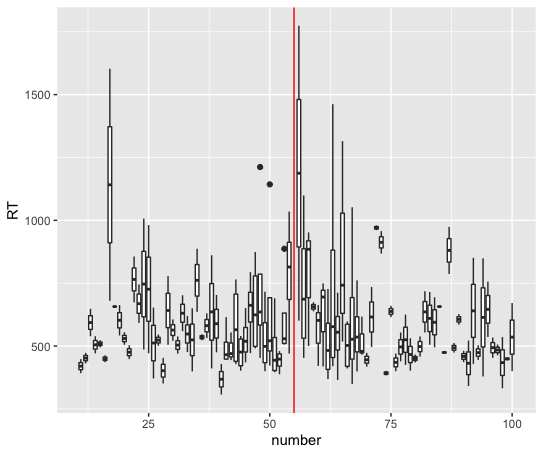

PCBS Project, May 2021
=====================
Dehaene et al.,1990 : Experiment 1
-----------------------------------
* Git Hub page:https://github.com/kvanvoor/PCBS_Project

The aim of our project was to produce a replication of Experiment 1 from Dehaene et al.,1990 as close as possible to the original paradigm. See [here](https://github.com/kvanvoor/PCBS_Project/blob/main/Dehaene%20et%20al.%20-%201990%20-%20Is%20numerical%20comparison%20digital%20Analogical%20and%20sy.pdf) for reference.

The experiment consists of a practice session and experimental session in which the participant is presented a number between 11 and 100, except the standard 55, and asked to determine whether it is greater than or less than 55. They are instructed to respond by pressing the 'f' or 'j' keys for 'less than' and 'greater than' respectively.

The stimuli were two pseudo-randomized lists which we created using R and manually implementing the paramters that were outlined in Dehaene et al. (1990), namely:
  * there were not three consecutive numbers greater than 55 or less than 55 presented.
  * there were never two of the same numbers presented consecutively,

As in Dehaene et al. (1990), we were concerned with measuring the response times of the participant during each trial. 


# Preparation of the stimuli
To generate a list of numbers we use a simple [R code](https://github.com/kvanvoor/PCBS_Project/blob/main/stimuli_list_generator.R) and exported the data frame into a csv file. Again, because we wanted to create an experiment as close as possible to the orginal, we followed the same constraints at Deheane et al. All numbers between 11 and 99 (except 55) were entered. Numbers between 41 and 69 were included 4 times, whereas as those outside of this range were included only twice.

Next, we randomly shuffled the list in excel. We then manually ensured that the list adhered to the parameters described above, used by Dehaene et al.

We then created a second trial list that reversed the order of the first, as Dehaene et al. did.

# Running the experiment

We included a practice session with ten stimuli that includes a feedback via a buzzer. The practice session is followed by the experimental session with the list order determined by the parity of subject number. The experiment can be run by simply entering "python distanceeffect.py" in to your terminal.

# Results & Analysis
After each run of ````distanceeffect.py````, a file (with extension .xpd) was created in the subfolder named data. We completed all basic analyses in R using `````Data_Analysis_PCBS_Project.R``` found [here](https://github.com/kvanvoor/PCBS_Project/blob/main/Data_Analysis_PCBS_Project.R).

We set out to generate a simple plot inspired by the Figure 1 in the Dehaene et al. (1990) paper. Recall that our aim was to complete a true replication of their Experiment 1. We used the R function ````read.expyriment.data```` to process all the data directly in R, since we were more familiar with R and had limited time. We then used the tidyr package to clean the data by removing incorrect answers labelled True or False in the ````is_correct````. We created a ````ggplot```` of boxplots of RTs for each number stimuli.

Because of limited time, we only completed one full run of the experiment. This likely accounts for the wide box plots and outliers in our plot. Although we cannot conclude anything from this plot (indeed, it is rather messy), we expect to find that over the course of many runs, we would be able to replicate the Dehaene et al. Experiment 1 results reliably using our ````distanceeffect.py````. 



# My python experience & what I learned

My previous coding experience was limited almost exclusively to R. I am relatively proficient in basic R plots and statistical analyses from past statistics courses. I was briefly exposed to python through the DataCamp online course last semester, but retained very little knowledge.

Although I was already familiar with the problem-solving thinking involved in coding through my experience in R, I believe this general skill was strengthened through this course. I also think my overall comfortability with the syntax and language of python improved a lot. The notion of clean code and implementing efficient functions was also a useful tool to acquire and apply to python and my R code in the future. Finally, learning to use my terminal, code in sublime, and navigate github, albeit initially rather unintuitive, was very useful and an invaluable skill.

I found learning the expyriment module in particular rather difficult. I relied heavily on the examples provided on github, but I was shocked to find very few resources online, especially discussing this particular module. This made it hard to problem solve on my own. In the future, I think it would have been very helpful to be more explicit in the various parts of expyriment and how it works together, the levels of "Design", "Block", "Trial." As a novice coder it was very hard to navigate on my own. 


# To Do
I would have liked to implement functions that would repeate the generating of trials, rather than repeating these for loops every time. Given the limited time, I chose to prioritize trying to analyze a bit of the data. 


References
----------
Dehaene, S., Dupoux, E., & Mehler, J. (1990). Is numerical comparison digital? Analogical and symbolic effects in two-digit number comparison. Journal of experimental Psychology: Human Perception and performance, 16(3), 626.


